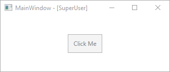

# Permission Controls

Adds support for Controls to be accessible based on defined permissions.

**Example:**


**App.xaml.cs**
```cs
public partial class App : Application, IPermissionControlApplication
{
	public UserType GetUserType(string username)
	{
		//Query DB or sth.
		return UserType.SuperUser;
	}
}
```
**MainWindow.xaml**
```xml
<!--Button not accessible to SuperUser-->
<Button Content="Click Me"		
		permissions:ControlPermissions.AuthorizedTypes="Users, Operators"
		permissions:ControlPermissions.NoPermissionBehaviour="Disabled">
</Button>
````

User:


Operator:


SuperUser:



Administrator:


